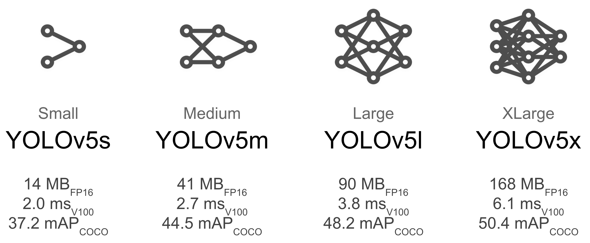

# 휴스타 ICT 텀프로젝트

- 음식데이터로 칼로리 계산
- 

## 1. 데이터 셋

UED FOOD 100 데이터셋을 사용

> http://foodcam.mobi/dataset100.html

다운받은 zip 파일을 코랩에 업로드

```py
from google.colab import files
file_uploaded = files.upload()
```

## 욜로 v5 특징

이미지 하나 당 라벨파일 하나 존재해야함.
```
image1.jpg, label1.txt
```

또한 라벨 파일 내 값은 정규화된 값이어야함 [0, 1]

문제

1. 위에 UED FOOD100 데이터셋에는 라벨이 한 파일안에 다 있음. 

2. 정규화도 안 되어 있음.

해결 방안
1. 위의 텍스트 파일을 전처리 해줘서 한 파일 안에 있는 라벨 값들을 각자의 파일로 나눈다!
2. 직접 데이터셋 만들기
   1. 음식 몇개 할 지 정하고
   2. 구글에 크롤링하고
   3. roboflow 에서 박스쳐서 데이터를 만든다. (한 계정당 무료로 1000개 가능.) 
   
   그래서 차라리 처음부터 끝까지 전부 다 해본다는 개념으로 접근하면 이미지 크롤링해서 모으고 직접 데이터셋 만들기. 최종발표 때 할 말도 많을 거 같음.
   

위의 데이터셋은 욜로v2 버전 때 쓰던 것인데 (darknet을 이용한) 욜로v5를 쓰면 다크넷을 쓸 필요 없음. 훨씬 간편함.


## 실전

### 0. Yolo v5 레포지토리 clone

```sh
git clone https://github.com/ultralytics/yolov5  # clone repo

cd yolov5
pip install -r requirements.txt  # 필요 패키지 설치
```

### 1. 데이터셋 만들기

디렉토리 구성
```
dataset
   └ train
      └ images
      └ labels
   └ test
      └ images
```

yaml 파일 생성(food.yaml)
```yaml
# 데이터셋 경로
train: /content/drive/MyDrive/dataset/train/images
val: /content/drive/MyDrive/dataset/train/images

# 클래스 수
nc: 100

# 클래스 이름
names: ['rice', 'eels on rice', 'pilaf', "chicken-'n'-egg on rice", ... , 'mixed rice', 'goya chanpuru']
```
- yolov5는 각 이미지에 대한 labels 파일들을 자동으로 읽음.
- 이미지 디렉토리와 같은 경로에 있어야 함. 위의 디렉토리 구성 참조.


labels의 txt 파일 내용
```
class x좌표 y좌표 넓이 높이
```
- x, y 좌표는 bounded object 중심 좌표
- 넓이, 높이는 사각형의 넓이, 높이

### 2. 학습하기

욜로에는 다양한 학습 모델이 있다.



```sh
python train.py --img 640 --batch 16 --epochs 5 --data coco128.yaml --weights yolov5s.pt
```

- weights : 사용할 모델 파일.
- 모델의 확장자는 .pt임
## 한계점

1. 낮은 학습률

   원인: 코랩의 런타임 시간 제한

   성능을 높이기 위해서는 학습시간이 오래 걸렸다.

   - 12시간 제한
   - 가진 데이터 양이 적어 한 클래스 당 100개의 이미지가 있는데 학습률을 좋게 하기 위해서 최소 2000번의 에포크가 필요했다.


   대안
   
   1. 로컬에서 학습. 멀티 GPU 모드로 학습을 하거나 좋은 그래픽카드 사용. (코랩에는 멀티GPU를 지원하지 않는다.)
   2. 클래스 수를 줄이기.
   3. 적어진 클래스 수 만큼 데이터 양을 늘려 학습하는 이미지만큼은 정확도를 높인다.


## 성능 평가

F1 curve : 

PR curve : 

P curve : 

R curve : 

   
