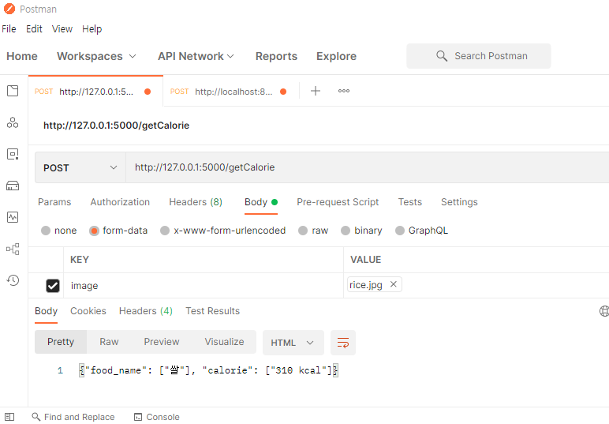

# 경북대학교 휴스타 ICT 졸업프로젝트

- 날짜 : 2021.03 ~ 진행 중

- 팀원

  김도균 - @dogyun-k 👍
  
  노유진 - @jin-you 👍
  
  백지원 - @hm06063 👍

## [0. 환경세팅 및 샘플데이터셋으로 YOLOv5 실습해보기](https://github.com/dogyun-k/Yolov5/blob/main/Summary/%EC%9A%9C%EB%A1%9C%EC%8B%A4%EC%8A%B5%ED%95%B4%EB%B3%B4%EA%B8%B0.md)

## [1. YOLOv5로 칼로리 계산하기](https://github.com/dogyun-k/Yolov5/blob/main/Summary/Food.md)

## [2. 이미지 인식을 활용한 웹 서비스 제작](https://github.com/dogyun-k/dietblog)

> 취업 준비를 서비스기업 백엔드 직군으로 준비하고 있어서 프로젝트를 이쪽 방향으로 진행했습니다.

### 1) 개요 

음식 사진을 찍어 업로드하면 칼로리를 계산하여 기록.

추후 칼로리 소모를 위한 운동영상 추천 등 다양한 컨텐츠를 추가할 예정.

> API 서버 구축 및 REST API 호출.

### 2) 요구사항

1. Springboot : 웹서버. UI 제공

	- 글 업로드 : title, content, date
	- 사진 업로드 : image
	- 글 수정 : title, content
	- 글 삭제 : seq
	- 글 조회
	- 전체 업로드 리스트 확인
	- 로그인/ 회원가입 : Oauth 소셜 로그인(Google, Naver..)

2. Flask : API 서버 (욜로v5)

	- 음식 인식 : image file
	- 음식이름 번역 : en food name
	- 음식 칼로리 크롤링 : kr food name

	
### 3) 시스템 설계

#### 구조

1. Web Server (Springboot)

	**URL**
	- [GET] /main : 메인화면 제공
	- [GET] /view : 업로드한 음식 리스트 제공
	- [GET] /create : 음식 사진 포스트 화면
	- [GET] /get-calorie : 사진 업로드 화면
	- [POST] /update : 글 수정
	- [POST] /delete : 글 삭제
	- [POST] /get-calorie : 욜로서버로 사진 전송, DB저장. Redirect to Main.
	
	**HTTP Message**

	파일 처리

	- Request Message
		
		Accept : Application/json

		Content-type : Multipart/form-data

	그 외 

	- Content-type : Application/json

	API Server와 통신은 RestTemplate 사용

2. API Server (Flask)

	**URL**
	- [POST] /getCalorie : 음식 사진 받아서 칼로리 값 응답

		
  
	- Naver Open API(Papago) 요청

	- 음식칼로리 크롤링	(DB에 저장하기엔 방대함.)

3. DB

	MySQL

	**User Entity**
	- Long | seq
	- String | id
	- String | pw
	- String | name

	**Post Entity**
	- Long | seq
	- String | title
	- String | melaType
	- File | file

	**File Entity**
	- Long | seq
	- String | filePath
	- String | originFileName
	- String | storedFileName
	- Post | postSeq

	사용자로부터 받은 이미지 파일은 서버 디렉토리에 저장. (DB에 저장 X)

	DB에는 파일 고유 번호와 파일 경로 저장.

#### UI 설계

- 아직 미구현

### 추후 계획

- React로 Front-end 구현

- Oauth 2.0으로 소셜 로그인 구현

- 현재 API서버 응답 시간이 1초 정도걸리는데 이를 단축

	- 이미지 검출 시간 줄이기 : Yolo v5 모델 개선
	
- API로직 개선 : 현재 API호출을 위해 사용하는 동기식 호출 방식인 RestTemplate를 비동기식인 WebClient로 마이그레이션.

- AWS로 호스팅
